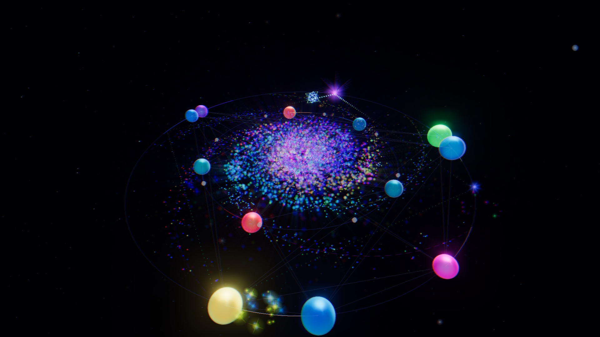

# soundSpace

**A 3D audio-visual instrument that runs in your browser.** Glowing nodes orbit
through space, and every time they cross paths they play a note. The notes are
snapped to a musical scale, so whatever the orbits do, it sounds like music.



**[▶ Open soundSpace](https://brandon-stargrave.github.io/soundSpace/)**. Nothing to install. Headphones recommended.

---

## What it is

soundSpace is a generative music toy and a playable instrument at the same
time. You set up a small solar system of orbiting nodes, and the collisions
between them become melodies. Each note sends a burst of colored particles
spiraling into the nebula at the center, so the picture slowly becomes a record
of everything you've heard.

You can let it play by itself, or shape it: change how fast the nodes move, how
notes get triggered, which scale they're in, and what the synths sound like.
Add up to five orbits, each with its own sound, and a slow harmonic layer that
walks the whole piece through chord changes.

When you want to take it further, soundSpace can drive real gear and software
over **MIDI** and **OSC**, and record **video with audio** at up to 4K.

- 5 independent orbits, each with its own scale and synth
- 3 motion algorithms, 3 trigger methods, and 8 ways to turn a trigger into a pitch
- 21 scales plus a custom scale editor
- A Harmonic Orbit that adds pad and bass drones and moves through chord progressions
- Bloom, motion trails, god rays, and chromatic aberration that react to the music
- MIDI and OSC output, 3D spatial audio, and video export
- Save and load your setups as preset files

## Getting started

### Try it in your browser

1. **Open [soundSpace](https://brandon-stargrave.github.io/soundSpace/)** in a
   desktop browser such as Chrome, Edge, Firefox, or Safari.
2. **Click the soundSpace button.** Browsers only allow sound after you click,
   so nothing plays until you do.
3. **Listen for a moment.** Nodes play a note each time they pass each other.
   Drag to look around and scroll to zoom.
4. **Open the Generator section** in the panel on the right. Try raising
   **Nodes**, or switch **Trigger** to *staticPins* to hear the orbit play like
   a music box.
5. **Open the Scale section** and pick a different **Root** or **Scale**. The
   melody changes key immediately.
6. **Open the Synth section** to change the instrument. Try *FMSynth* or
   *PluckSynth*, and turn up the reverb.
7. **Click `+`** in the orbit bar to add a second orbit. Click its number to edit
   it, and give it a different scale or synth.
8. **Open Presets and click Save** to download your setup as a `.json` file.
   **Load** brings it back later.

If you're not hearing anything, check that the tab isn't muted, that
**Mute** at the top of the panel is off, and that the page has focus: by
default soundSpace goes quiet when you switch to another tab.

### Run it locally

You need [Node.js](https://nodejs.org/) 20 or newer.

1. Clone the repository:

   ```bash
   git clone https://github.com/brandon-stargrave/soundSpace.git
   ```

2. Install the dependencies:

   ```bash
   cd soundSpace && npm install
   ```

3. Start the development server:

   ```bash
   npm run dev
   ```

   It opens soundSpace at `http://localhost:5173` and reloads as you edit.

To build a static copy you can host anywhere, run `npm run build` and serve the
`dist/` folder.

### Controls

Drag with the left mouse button to rotate the view, drag with the right button
to pan, and scroll to zoom.

| Key | Action |
|---|---|
| `Space` | Pause or resume |
| `M` | Mute or unmute |
| `H` | Reset the camera |
| `O` | Toggle a slow cinematic orbit (hover the orbit button to set its speed) |
| `F` | Toggle fullscreen |
| `U` | Show or hide the panel |
| `S` | Save a preset (while the panel is hidden) |
| `*` | Launch a shooting star |

In fullscreen with the panel hidden, the buttons and cursor fade away after a
few seconds so you can use soundSpace as a visualizer.

### Browser support

| | Chrome / Edge | Firefox | Safari |
|---|---|---|---|
| Visuals and sound | ✓ | ✓ | ✓ |
| MIDI output | ✓ | ✓ (asks you to allow it) | ✗ no Web MIDI |
| OSC output | ✓ | ✓ | Run locally (see below) |
| Recording | ✓ | ✓ | ✓ |

A desktop or laptop with a dedicated or recent integrated GPU is recommended.

---

## Advanced features

### How it works

Each orbit is a small pipeline, and every stage can be swapped from the
Generator section:

1. **Motion** decides how fast each node travels. With *none*, nodes keep fixed
   speed ratios. *phaseDrift* keeps them nearly in step so patterns shift slowly,
   *harmonicRatios* locks speeds to musical intervals like fifths and just
   intonation, and *goldenSpiral* uses irrational ratios so the pattern never
   exactly repeats.
2. **Trigger** decides when a note fires. *nodeCollision* fires when two nodes
   pass each other, *staticPins* places fixed pins on the ring like a music box
   (evenly, in a Euclidean rhythm, or in an uneven "scale" layout), and
   *zoneTriggers* fires when a node enters or leaves an arc of the ring.
3. **Note Mapping** turns the trigger into a raw pitch: from the *angle* where
   it happened, the *nodeIndex*, the node's *velocity* or *energy*, how
   crowded the ring is (*density*), its *phaseOffset* or *relativePosition*
   among the other nodes, or the distance it has traveled (*cumulativePhase*).
4. **Scale** quantizes that pitch into the chosen key, scale, and octave range.
5. **Outputs** play the note on the orbit's synth, and on MIDI and OSC when those
   are enabled.

### Harmonic Orbit

The Harmonic Orbit section adds a slow layer on top of the melody. A traveler
moves around a polygon (3 to 12 sides), and each time it reaches a corner it
can move every orbit to a new root note. Two drones follow along: a **pad**
that holds a chord and a **bass** that holds the root.

- **Progression** sets how the root moves: *pedal* mostly stays home,
  *romanPopAxis*, *romanCanonical*, and *romanJazzii_v_I* follow familiar chord
  loops, *randomWalk* wanders through the scale, and *fifthsUp* and
  *fifthsRandom* travel around the circle of fifths.
- **Speed Mode** runs the traveler at its own tempo (*free*, in edges per
  minute) or locks it to an orbit's rotation (*periodSync*).
- **Chord Voicing** chooses triads, sus chords, sevenths, or octave-doubled pads.
- Each drone has its own synth, envelope, and effects under **Pad Synth** and
  **Bass Synth**.

### MIDI output

soundSpace can play hardware synths, drum machines, or any DAW that accepts
MIDI input. It uses the Web MIDI API, which Chrome, Edge, and Firefox support
and Safari does not.

1. Open **MIDI / OSC** and turn on **MIDI Enabled**. Your browser asks for
   permission the first time.
2. Choose your **Device**. Devices you plug in later appear automatically.
3. Set the **Base Channel**. Orbit 1 plays on that channel, orbit 2 on the next
   one up, and so on.

**Note Duration** sets how long each MIDI note is held, and **Velocity Curve**
shapes how hard notes hit.

To send the Harmonic Orbit's drones as well, turn on **Send MIDI** in the
Harmonic Orbit section. The pad and bass use their own channels (15 and 16 by
default) so you can route them to separate instruments.

soundSpace sends note-offs for held notes when you mute, turn MIDI off, switch
devices, or close the page, so drones don't get stuck on your gear.

> **Tip:** on macOS, the IAC Driver (Audio MIDI Setup → MIDI Studio) gives you
> a virtual MIDI port to route soundSpace into Ableton Live, Logic, or any other
> app on the same machine.

### OSC output

Browsers can't send OSC's UDP packets directly, so soundSpace talks to a small
relay that runs on your computer and forwards each message as OSC.

1. Start the relay from your local copy of the repository:

   ```bash
   npm run dev:osc
   ```

   It listens on `ws://127.0.0.1:8080` and sends OSC to `127.0.0.1:9000`.
   You can run it next to `npm run dev`, or use `npm start` to build the app and
   serve it and the relay together at `http://127.0.0.1:3000`.

2. In **MIDI / OSC**, turn on **OSC Enabled**. soundSpace connects to the relay
   and reconnects on its own if the relay restarts.

3. Point your receiving software (TouchDesigner, Max/MSP, Pure Data, a VJ app,
   and so on) at UDP port 9000.

The hosted page can also use a relay on your machine. Your browser may ask for
permission to reach devices on your local network; allow it. If the connection
is refused anyway (Safari is the most likely to block it), run soundSpace
locally and use it from `http://localhost`.

**Messages**

| Address | Arguments |
|---|---|
| `/soundspace/orbit{N}/node{M}/note` | MIDI note (int), velocity 0–1 (float), raw pitch value 0–1 (float), generator ID (string) |
| `/soundspace/harmonic/pad` | root name (string), note count (int), MIDI notes (ints), frequencies in Hz (floats) |
| `/soundspace/harmonic/bass` | same as `pad` |
| `/soundspace/harmonic/transpose` | root name (string), root pitch class 0–11 (int) |

Orbit and node numbers start at 1. Harmonic messages are sent when **Send OSC**
is on in the Harmonic Orbit section.

**Relay settings.** Set these environment variables when you start the relay:

| Variable | Default | What it controls |
|---|---|---|
| `OSC_HOST` | `127.0.0.1` | Where OSC is sent |
| `OSC_PORT` | `9000` | UDP port OSC is sent to |
| `WS_PORT` | `8080` | Port the browser connects to |
| `PORT` | `3000` | Port for the built app (`npm start`) |
| `HOST` | `127.0.0.1` | Address the relay and app listen on |
| `ALLOWED_ORIGINS` | *(none)* | Extra comma-separated web origins allowed to connect |

For example, to send OSC to another computer on your network:

```bash
OSC_HOST=192.168.1.50 OSC_PORT=7000 npm run dev:osc
```

The relay only listens on your own machine by default and only accepts
connections from soundSpace itself (local pages and the official hosted site),
so other websites you visit can't send messages through it. If you set
`HOST=0.0.0.0` to reach it from other devices, keep in mind that anyone on your
network can then connect.

### Spatial audio

Turn on **Enable Spatial Panning** in **MIDI / OSC** to place each note in 3D
space where it was triggered, relative to the camera. It sounds best on
headphones. **Vertical** maps top and bottom to left and right, for phones held
upright with speakers at each end.

### Recording and export

The **Record** section captures the visuals and the audio together.

1. Choose a **Preset** resolution: *Match Window*, 720p, 1080p, 1440p, 4K, or a
   *Custom* size, in landscape or portrait. The view letterboxes to show
   exactly what will be captured, at exactly that many pixels.
2. Choose a **Format** and **Frame Rate**:
   - **Compressed MP4 (H.264)** for sharing.
   - **ProRes 4444 MOV** for editing and compositing. The files are large.
3. Click **Record**, and click **Stop** when you're done. The file downloads
   when it's ready.

Browsers record in their own format first, and soundSpace converts the result
with [ffmpeg.wasm](https://github.com/ffmpegwasm/ffmpeg.wasm). The first
conversion downloads the encoder (about 30 MB) from unpkg.com. Conversion runs
on your computer and takes a while for long or high-resolution takes. Safari
records MP4 directly, so MP4 exports there skip conversion.

If a recording is too large to convert in the browser (roughly 700 MB) or the
conversion fails, soundSpace saves the original recording instead, usually a
`.webm` file that plays in any browser or VLC, so a take is never lost.

High resolutions can lower the frame rate while recording.

### Presets

**Save** downloads everything as a `.json` file: every orbit's generator,
scale, and synth settings, the Harmonic Orbit, spatial audio, and the camera
position. **Load** restores it. **Demo** loads `presets/niceStart.json`, a good
place to start exploring; the `presets/` folder has more examples.

### Project structure

```
src/
  core/         engine, render loop, scale quantizer, harmonic orbit, output routing
  generators/   orbiting nodes plus pluggable motion/, triggers/, and mapping/ modules
  output/       Tone.js synths, Web MIDI, and OSC over WebSocket
  visual/       Three.js scene, post-processing, particle materials
  capture/      MediaRecorder capture and ffmpeg.wasm conversion
  ui/           control panel sections
server.js       static server and WebSocket → UDP OSC relay
```

New motion algorithms, trigger methods, and note mappings register themselves in
the `*Registry.js` file of their folder and appear in the UI automatically.

For debugging, the running engine is available in the browser console as
`window._soundSpace`. Set `window._soundSpace.debugPerf = true` to log frame
rate and draw calls every two seconds.

---

## License

soundSpace is released under the [MIT License](LICENSE).

It is built with [three.js](https://threejs.org/), [Tone.js](https://tonejs.github.io/),
and [ffmpeg.wasm](https://github.com/ffmpegwasm/ffmpeg.wasm). See
[THIRD_PARTY_LICENSES.md](THIRD_PARTY_LICENSES.md) for their licenses. The
ffmpeg.wasm encoder core downloaded for recording is licensed separately under
the GPL and is not included in this project.
