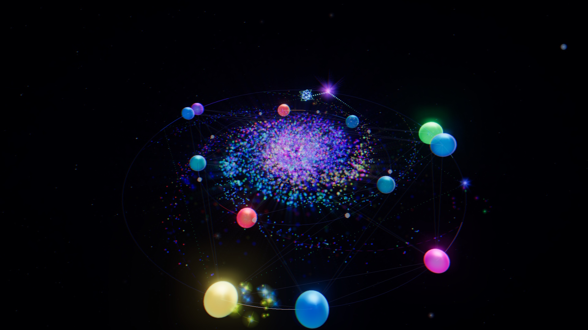

# soundSpace

**A 3D audio-visual instrument that runs in your browser.** Glowing nodes orbit
through space, and every time they cross paths they play a note. The notes are
snapped to a musical scale, so whatever the orbits do, it sounds like music.



**[▶ Open soundSpace](https://brandon-stargrave.github.io/soundSpace/)**. Nothing to install. Headphones recommended.

---

## What it is

soundSpace is a generative music toy and a playable instrument at the same
time. You set up a small solar system of orbiting nodes, and the collisions
between them become melodies. Each note sends a burst of colored particles
spiraling into the nebula at the center, so the picture slowly becomes a record
of everything you've heard.

You can let it play by itself, or shape it: change how fast the nodes move, how
notes get triggered, which scale they're in, and what the synths sound like.
Add up to five orbits, each with its own sound, and a slow harmonic layer that
plays chords under the whole piece.

When you want to take it further, soundSpace can drive real gear and software
over **MIDI** and **OSC**, and record **video with audio** at up to 4K.

- 5 independent orbits, each with its own scale and synth, and a Mute and Solo for each
- 3 motion algorithms, 3 trigger methods, and 8 ways to turn a trigger into a pitch
- 21 scales plus a custom scale you build by clicking notes
- A Harmonic Orbit that adds pad and bass drones playing chord progressions in key
- Bloom, motion trails, god rays, and color split that react to the music, with a calm mode
- MIDI and OSC output, 3D spatial audio, and video export
- Five example setups, preset files, and links that share a setup in one click

## Getting started

### Try it in your browser

1. **Open [soundSpace](https://brandon-stargrave.github.io/soundSpace/)** in a
   desktop browser such as Chrome, Edge, Firefox, or Safari.
2. **Click the soundSpace button.** Browsers only allow sound after you click,
   so nothing plays until you do. A short guide opens on your first visit;
   press `?` to bring it back.
3. **Listen for a moment.** Nodes play a note each time they pass each other.
   Drag to look around and scroll to zoom.
4. **Open Presets** in the panel on the right, pick an **Example**, and click
   **Open** to hear what soundSpace can do.
5. **Open Orbit 1 · Generator.** Try raising **Nodes**, or switch **Trigger** to
   *Static Pins* to hear the orbit play like a music box.
6. **Open Scale** and pick a different **Root** or **Scale**. The melody changes
   key immediately.
7. **Open Synth** to change the instrument. Try the *FM* or *Pluck (string)*
   **Voice**, and turn up the reverb **Mix**.
8. **Click `+`** in the orbit bar to add another orbit. Click its number to edit
   it, and give it a different scale or synth.
9. **Save your setup** from **Presets**: **Save** downloads it as a `.json`
   file, and **Copy link** copies a link that opens it for anyone.

If you're not hearing anything, check that the tab isn't muted, that **Mute**
at the top of the panel is off, that **Volume** is up, and that no orbit is
muted or another one soloed. By default soundSpace also goes quiet while its
tab is hidden; turn off **Silence when tab is hidden** to change that.

### Run it locally

You need [Node.js](https://nodejs.org/) 20 or newer.

1. Clone the repository:

   ```bash
   git clone https://github.com/brandon-stargrave/soundSpace.git
   ```

2. Install the dependencies:

   ```bash
   cd soundSpace && npm install
   ```

3. Start the development server:

   ```bash
   npm run dev
   ```

   It opens soundSpace at `http://localhost:5173` and reloads as you edit.

To build a static copy you can host anywhere, run `npm run build` and serve the
`dist/` folder. `npm test` runs the test suite.

### Controls

Drag with the left mouse button to rotate the view, drag with the right button
to pan, and scroll to zoom.

| Key | Action |
|---|---|
| `Space` | Pause or resume |
| `M` | Mute or unmute |
| `H` | Reset the camera |
| `O` | Toggle a slow cinematic orbit (hover the orbit button to set its speed) |
| `F` | Toggle fullscreen |
| `U` | Show or hide the panel |
| `S` | Save a preset (while the panel is hidden) |
| `*` | Launch a shooting star |
| `?` | Show the guide and these shortcuts |

Shortcuts don't fire while you're typing in a text field. In fullscreen with the
panel hidden, the buttons and cursor fade away after a few seconds so you can
use soundSpace as a visualizer.

### Browser support

| | Chrome / Edge | Firefox | Safari 16.4+ |
|---|---|---|---|
| Visuals and sound | ✓ | ✓ | ✓ (less tested) |
| MIDI output | ✓ | ✓ (asks you to allow it) | ✗ no Web MIDI |
| OSC output | ✓ with the relay | ✓ with the relay | Run locally (see below) |
| Recording | ✓ MP4 directly | ✓ converted to MP4 | ✓ MP4 directly |

A desktop or laptop with a dedicated or recent integrated GPU is recommended.
On phones and tablets soundSpace plays and the panel starts hidden (tap the
**Controls** tab at the right edge to open it); MIDI, OSC, and recording are
meant for a computer.

soundSpace follows your system's reduced-motion setting: when it's on, the
color-split flashes and shooting stars are turned off and the bursts of light
are softened. **Calm visuals** in the **Visuals** section does the same by hand.

---

## Advanced features

### How it works

Each orbit is a small pipeline, and every stage can be swapped in the orbit's
**Generator** section:

1. **Motion** decides how fast each node travels. With *None*, nodes keep fixed
   speed ratios set by **Node Speed**. *Phase Drift* keeps them nearly in step
   so patterns shift slowly, *Harmonic Ratios* locks speeds to musical
   intervals like fifths and just intonation, and *Golden Spiral* uses
   irrational ratios so the pattern never exactly repeats.
2. **Trigger** decides when a note fires. *Node Collision* fires when two nodes
   pass each other, *Static Pins* places fixed pins on the ring like a music box
   (evenly, in a Euclidean rhythm, or in an uneven layout), and *Zone Triggers*
   fires when a node enters or leaves an arc of the ring.
3. **Pitch From** turns the trigger into a raw pitch: from the *Angle* where it
   happened, the *Node Index*, the node's *Velocity* or *Energy*, how crowded
   the ring is (*Density*), its *Phase Offset* or *Relative Position* among the
   other nodes, or the distance it has traveled (*Cumulative Phase*).
4. **Scale** snaps that pitch into the chosen key, scale, and octave range.
   **Pitch Layout** chooses how the raw pitch spreads over the notes. Pick
   *Custom* to build your own scale by clicking notes.
5. **Outputs** play the note on the orbit's synth, and on MIDI and OSC when those
   are enabled.

Triggers are checked many times per frame, so a crossing is never missed, even
when the frame rate drops or the nodes move fast.

### Orbits, mute and solo

The orbit bar at the top of the panel shows one button per orbit. Click a number
to edit that orbit, `+` to add one (up to five), `×` to remove the selected one
(a message offers Undo), and `⧉` / `⧫` to copy one orbit's settings onto
another. **Mute** and **Solo** under the bar silence the selected orbit or play
it alone. They apply to its synth, MIDI, and OSC alike, the orbit keeps
moving on screen, and both are saved with your setup.

### Harmonic Orbit

The Harmonic Orbit section adds a slow layer under the melody. A traveler moves
around a polygon (3 to 12 sides), and each time it reaches a corner the chord
changes. Two drones follow along: a **pad** that holds the chord and a **bass**
that holds its root. **Now** shows the key and the chord that's playing.

- **Chords** sets the progression. *Pedal* mostly stays on the home chord,
  *I–V–vi–IV*, *I–IV–V–I*, and *ii–V–I* follow familiar loops, and *Random walk*
  wanders. These all stay in the orbits' key: in C major, I–V–vi–IV plays C,
  G, Am, and F, built from the notes of the scale, so the melody always fits.
  *Circle of fifths* and *Fifths up or down* change key instead, moving every
  orbit to the new key by the shortest step.
- **Timing** runs the traveler at its own **Speed** (*Own speed*, in edges per
  minute) or locks it to an orbit's rotation (*Follow an orbit*).
- **Voicing** chooses triads, sus chords, sevenths, or an open, octave-doubled
  pad. Chords move to the nearest inversion, so the pad glides instead of
  jumping.
- Each drone has its own level and octave here, and its own synth, envelope, and
  effects under **Pad Synth** and **Bass Synth**.

### MIDI output

soundSpace can play hardware synths, drum machines, or any DAW that accepts
MIDI input. It uses the Web MIDI API, which Chrome, Edge, and Firefox support
and Safari does not.

1. Open **MIDI / OSC** and turn on **MIDI Enabled**. Your browser asks for
   permission at that moment, never before; if you decline, the section says
   so and MIDI stays off.
2. Choose your **Device**. Devices you plug in later appear automatically.
3. Set the **Base Channel**. Orbit 1 plays on that channel, orbit 2 on the next
   one up, and so on, wrapping around after 16. The section lists which orbit
   plays on which channel.

**Note Length** sets how long each MIDI note is held, and **Velocity Curve**
shapes how hard notes hit.

To send the Harmonic Orbit's drones as well, turn on **Send MIDI** in the
Harmonic Orbit section. The pad and bass use their own channels (15 and 16 by
default) so you can route them to separate instruments. soundSpace warns you if
an orbit ends up on the same channel.

soundSpace sends note-offs for held notes when you mute, pause, turn MIDI off,
switch devices, or close the page, so drones don't get stuck on your gear.

> **Tip:** on macOS, the IAC Driver (Audio MIDI Setup → MIDI Studio) gives you
> a virtual MIDI port to route soundSpace into Ableton Live, Logic, or any other
> app on the same machine.

### OSC output

Browsers can't send OSC's UDP packets directly, so soundSpace talks to a small
relay that runs on your computer and forwards each message as OSC.

1. Start the relay from your local copy of the repository:

   ```bash
   npm run dev:osc
   ```

   It listens on `ws://127.0.0.1:8080` and sends OSC to `127.0.0.1:9000`.
   You can run it next to `npm run dev`, or use `npm start` to build the app and
   serve it and the relay together at `http://127.0.0.1:3000`.

2. In **MIDI / OSC**, turn on **OSC Enabled**. The status line shows whether
   soundSpace is connected, and it reconnects on its own if the relay restarts.
   **Relay Host** and **Relay Port** point it at a relay elsewhere.

3. Point your receiving software (TouchDesigner, Max/MSP, Pure Data, a VJ app,
   and so on) at UDP port 9000.

The hosted page can use a relay on the same computer: Chrome, Edge, and Firefox
let a secure page reach `127.0.0.1`. Your browser may ask for permission to
reach devices on your local network; allow it. A secure page can't reach a
relay on another machine, and Safari blocks it entirely; in those cases run
soundSpace locally, as below.

**Messages**

| Address | Arguments |
|---|---|
| `/soundspace/orbit{N}/node{M}/note` | MIDI note (int), velocity 0–1 (float), raw pitch value 0–1 (float), orbit name such as `orbit1` (string) |
| `/soundspace/harmonic/pad` | chord root name (string), note count (int), MIDI notes (ints), frequencies in Hz (floats) |
| `/soundspace/harmonic/bass` | same as `pad` |
| `/soundspace/harmonic/transpose` | new key name (string), its pitch class 0–11 (int) |

Orbit and node numbers start at 1 and stay the same when you save and reload a
setup. Harmonic messages are sent when **Send OSC** is on in the Harmonic Orbit
section. When the drones stop, `pad` and `bass` are sent once more with an empty
root and a note count of 0. `transpose` is sent only when the key changes.

**Relay settings.** Set these environment variables when you start the relay:

| Variable | Default | What it controls |
|---|---|---|
| `OSC_HOST` | `127.0.0.1` | Where OSC is sent |
| `OSC_PORT` | `9000` | UDP port OSC is sent to |
| `WS_PORT` | `8080` | Port the browser connects to |
| `PORT` | `3000` | Port for the built app (`npm start`) |
| `SOUNDSPACE_HOST` | `127.0.0.1` | Address the relay and app listen on |
| `ALLOWED_ORIGINS` | *(none)* | Extra comma-separated web origins allowed to connect |

For example, to send OSC to another computer on your network:

```bash
OSC_HOST=192.168.1.50 OSC_PORT=7000 npm run dev:osc
```

The relay only listens on your own machine by default and only accepts
connections from soundSpace itself (local pages and the official hosted site),
so other websites you visit can't send messages through it.

**Using soundSpace from another device.** To play from a tablet or a second
computer on your network, run everything on one machine and open it from the
other. If that machine's address is `192.168.1.20`:

```bash
SOUNDSPACE_HOST=0.0.0.0 ALLOWED_ORIGINS=http://192.168.1.20:3000 npm start
```

Then open `http://192.168.1.20:3000` on the other device and set **Relay Host**
to `192.168.1.20`. Anyone on your network can reach the relay while it listens
on `0.0.0.0`, so only do this on a network you trust.

### Spatial audio

Turn on **3D Panning** at the top of the panel to place each note in 3D space
where it was triggered, relative to the camera. It sounds best on headphones.
**Phone upright** maps top and bottom to left and right, for phones held upright
with speakers at each end.

### Recording and export

The **Record** section captures the visuals and the audio together.

1. Under **Viewport Resolution**, choose a **Preset**: *Match Window*, 720p,
   1080p, 1440p, 4K, or a *Custom* size, and an **Orientation** for the fixed
   sizes. The view letterboxes to show exactly what will be captured, at
   exactly that many pixels.
2. Choose a **Format** and **Frame Rate**:
   - **MP4 (H.264)** plays everywhere and is the default.
   - **WebM (no conversion)** appears in browsers that record WebM, and saves
     the recording exactly as the browser made it.
3. Click **Record**, and click **Stop** when you're done. The file downloads
   when it's ready.

Chrome, Edge, and Safari record MP4 directly, so there's nothing to wait for.
Browsers that can't, such as Firefox, record WebM and soundSpace converts it
with [ffmpeg.wasm](https://github.com/ffmpegwasm/ffmpeg.wasm). The first
conversion downloads the encoder (about 32 MB) from unpkg.com, and the status
line shows its progress. Conversion runs on your computer and takes a while for
long or high-resolution takes. **Cancel conversion** stops it and saves the
original recording instead.

If a recording is too large to convert in the browser (roughly 700 MB) or the
conversion fails, soundSpace saves the original recording instead, usually a
`.webm` file that plays in any browser or VLC, so a take is never lost.

While recording, the size and format controls are locked, the recording pauses
if you switch tabs, and the page asks before you close it. High resolutions can
lower the frame rate while recording.

### Presets and share links

Open **Presets** to:

- **Open an example.** Pick one of five setups from **Examples** (Music Box,
  Harmonic Drift, Polyrhythm, Zones, Night Garden) and click **Open**.
- **Save** your setup as a `.json` file, and **Load** it back later. A preset
  holds every orbit's generator, scale, and synth settings and its mute and solo
  state, the Harmonic Orbit, the camera, 3D panning, the Visuals settings, and
  your MIDI and OSC settings.
- **Copy link** to share a setup. The link holds the same settings as a preset
  except MIDI and OSC, so opening someone's link never sends anything to your
  gear. The setup loads after you click to start, and the link is then cleared
  from the address bar.

Presets and links are checked before anything changes: a damaged or foreign
file shows a message and leaves your current setup alone. Loading a preset,
opening an example, or removing an orbit shows a message with **Undo**.

### Project structure

```
src/
  core/         engine, render loop, scale quantizer, harmony, harmonic orbit, preset validation
  generators/   orbiting nodes plus pluggable motion/, triggers/, and mapping/ modules
  output/       Tone.js synths and effects, Web MIDI, and OSC over WebSocket
  visual/       Three.js scene, post-processing, particle materials
  capture/      MediaRecorder capture and ffmpeg.wasm conversion
  ui/           control panel sections, help, share links, messages
server.js       static server and WebSocket → UDP OSC relay
server/         the relay's OSC encoder
presets/        the bundled example setups
public/         styles, icons, and the social preview image
tests/          node --test suites for the pure modules and bundled presets
```

New motion algorithms, trigger methods, and note mappings register themselves in
the `*Registry.js` file of their folder and appear in the UI automatically.

For debugging, the running engine is available in the browser console as
`window._soundSpace`. Set `window._soundSpace.debugPerf = true` to log frame
rate and draw calls every two seconds.

---

## License

soundSpace is released under the [MIT License](LICENSE).

It is built with [three.js](https://threejs.org/), [Tone.js](https://tonejs.github.io/),
and [ffmpeg.wasm](https://github.com/ffmpegwasm/ffmpeg.wasm). See
[THIRD_PARTY_LICENSES.md](THIRD_PARTY_LICENSES.md) for their licenses. The
ffmpeg.wasm encoder core downloaded for converting recordings is licensed
separately under the GPL and is not included in this project.
